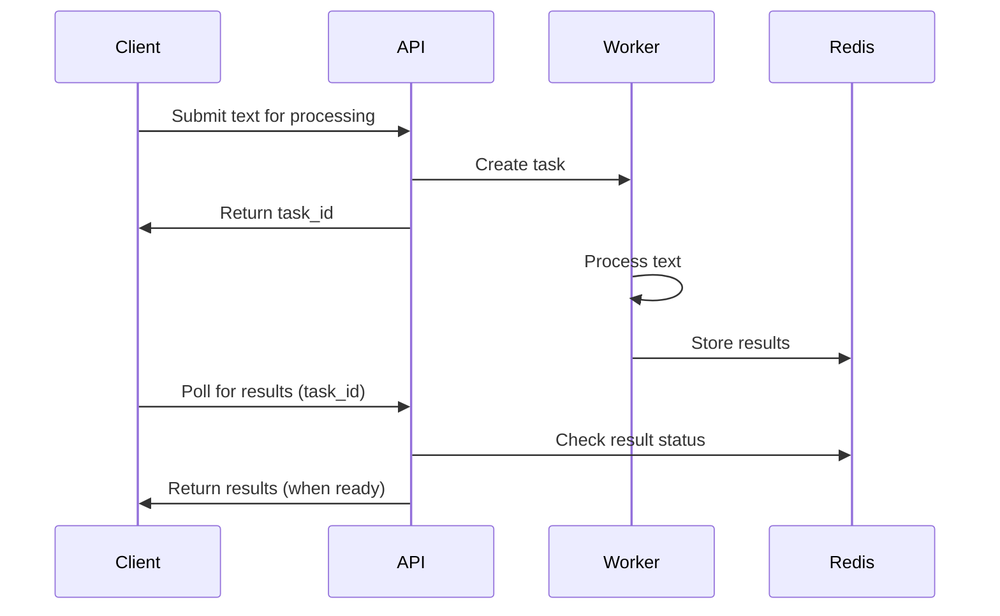

# API Overview

## Introduction

The Text Processing API provides advanced natural language processing capabilities through a simple RESTful interface. This guide explains the key concepts, workflow, and implementation details to help you effectively integrate with our API.

## Core Concepts

### Asynchronous Processing

The API uses an asynchronous processing model:



This approach offers several advantages:

- **Performance**: Long-running NLP operations don't block the API
- **Scalability**: Workers can be scaled independently based on load
- **Reliability**: Tasks are queued and processed reliably even under heavy load


## Request Flow

### 1. Submit Processing Request

Send your text to the appropriate endpoint:

```python
import requests

response = requests.post(
    "http://your-api-host:8000/summarize",
    json={"text": "Your text to be summarized..."}
)

# Extract the task ID
task_id = response.json()["task_id"]
```

### 2. Poll for Results

Check if your results are ready:

```python
import time

# Initialize with pending status
status = "PENDING"
result = None

# Poll until complete (implement with backoff in production)
while status == "PENDING":
    # Wait before checking again
    time.sleep(1)
    
    # Check current status
    response = requests.get(f"http://your-api-host:8000/tasks/{task_id}")
    data = response.json()
    status = data.get("status")
    
    # If complete, get the result
    if status == "SUCCESS":
        result = data.get("result")
```

### 3. Process Results

Once processing is complete, use the results in your application:

```python
if result:
    # For summarization
    summary = result.get("summary")
    print(f"Text Summary: {summary}")
    
    # For categorization
    category = result.get("category")
    print(f"Text Category: {category}")
    
    # For keyword extraction
    keywords = result.get("keywords")
    print(f"Keywords: {', '.join(keywords)}")
```


## Task Status Values

When polling for results, you may receive these status values:

| Status | Meaning |
|--------|---------|
| PENDING | Task is queued or in progress |
| SUCCESS | Task completed successfully |
| FAILURE | Task failed with an error |

## Best Practices


## Next Steps

- Explore the [API Endpoints](endpoints.md) for detailed information on each endpoint
- Check the [LLM Models](../llm-models.md) documentation to learn about the underlying models
- See the [Prompting Strategy](../prompting-strategy.md) guide for optimizing results
