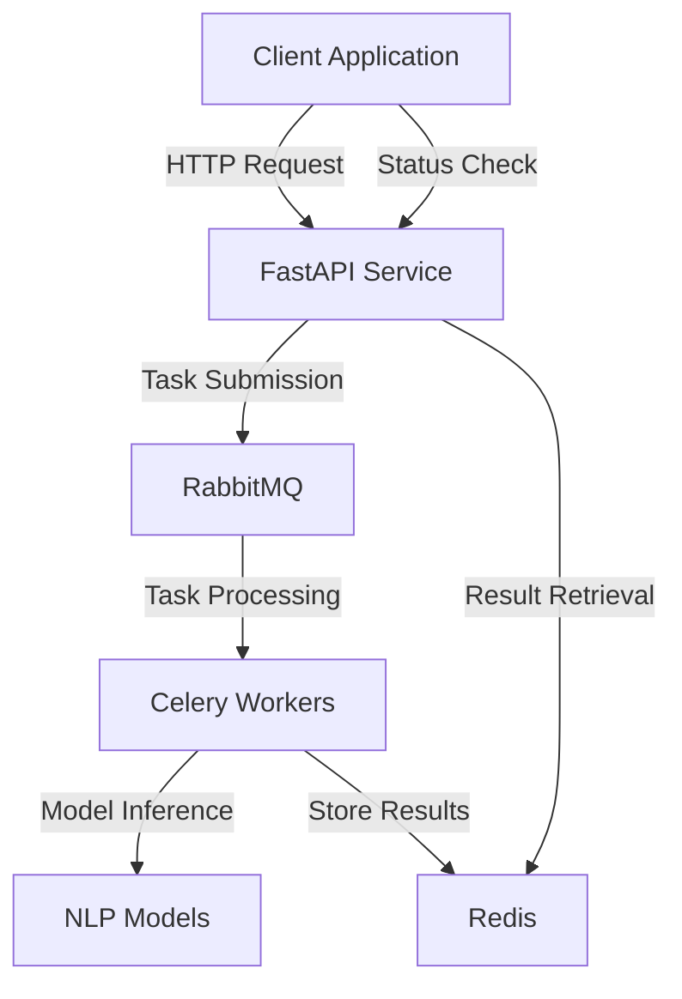

# Getting Started

## Introduction

Welcome to the Text Processing API! This guide will help you quickly get up and running with our powerful natural language processing capabilities.

## Quick Start

The Text Processing API allows you to perform advanced text analysis operations through simple API calls. Here's how to get started in minutes:

### 1. Prerequisites

- Access to the API server (default: `http://localhost:8000`)
- An HTTP client (curl, Postman, or your preferred programming language)
- Basic familiarity with RESTful APIs

### 2. Basic Workflow

All text processing operations follow the same pattern:

1. Submit text to the appropriate endpoint
2. Receive a task ID for tracking
3. Poll the task status endpoint until processing is complete
4. Retrieve your results

### 3. Your First API Call

Let's try summarizing a text passage:

```python
import requests
import time

# API base URL
base_url = "http://localhost:8000"

# Text to be processed
text = """
Climate change is the long-term alteration of temperature and typical weather patterns in a place. 
Climate change could refer to a particular location or the planet as a whole. Climate change may 
cause weather patterns to be less predictable. These unexpected weather patterns can make it 
difficult to maintain and grow crops in regions that rely on farming because expected temperature 
and rainfall levels can no longer be relied on.
"""

# Step 1: Submit text for summarization
response = requests.post(
    f"{base_url}/summarize",
    json={"text": text}
)
task_id = response.json()["task_id"]
print(f"Task submitted with ID: {task_id}")

# Step 2: Wait for processing to complete
result = {"status": "PENDING"}
while result.get("status") == "PENDING":
    time.sleep(1)  # Poll every second
    response = requests.get(f"{base_url}/tasks/{task_id}")
    result = response.json()
    print(f"Task status: {result.get('status')}")

# Step 3: Display the result
if result.get("status") == "SUCCESS":
    print("Summary:")
    print(result.get("summary"))
else:
    print(f"Error: {result.get('error', 'Unknown error')}")
```

## Available Operations

The API offers several text processing capabilities:

| Operation | Endpoint | Description |
|-----------|----------|-------------|
| Summarization | `/summarize` | Creates concise summaries of long texts |
| Categorization | `/categorize` | Classifies text into relevant categories |
| Keyword Extraction | `/extract-keywords` | Identifies key terms and concepts |
| Comprehensive Analysis | `/process` | Performs all operations at once |

## Best Practices

1. **Implement polling with backoff**: When checking task status, use an exponential backoff strategy
2. **Validate input text**: Ensure your text is properly formatted before sending
3. **Handle timeouts**: Set reasonable timeouts for API calls
4. **Error handling**: Always check response status codes and handle errors gracefully

## System Architecture

The Text Processing API is built on a scalable, asynchronous architecture:



### Key Components

- **FastAPI Service**: Handles HTTP requests and task management
- **RabbitMQ**: Message queue for asynchronous task processing
- **Celery Workers**: Process text analysis tasks in the background
- **Redis**: Stores task results and status information
- **NLP Models**: Large language models that power the text analysis


## Next Steps

- Explore the [API Overview](api/overview.md) for more details on the API design
- Check the [Endpoints Documentation](api/endpoints.md) for detailed endpoint information
- Learn about the [LLM Models](llm-models.md) powering the text analysis
